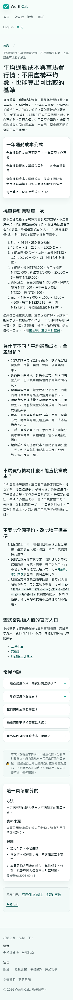

# S6 正文行內連結與 44px 觸控目標補證據

## CSS 實際選擇器

44px 規則只套用於導覽、卡片、按鈕、表單與其他明確觸控目標：

```css
.site-header a,
.site-footer a,
.breadcrumb a,
.topic-links a,
.directory-list a,
.directory-jump a,
.home-library__links a,
.guide-card h3 a,
.card h3 a,
.related-links a,
.affiliate-card,
.button {
  display: inline-flex;
  align-items: center;
  min-height: 2.75rem;
  min-width: 2.75rem;
}
```

全域 `a` 只保留顏色、底線與轉場；沒有全域 `min-height`／`min-width`／`display`。因此正文的 `p a`、`li a` 等行內連結不會被 44px 規則撐開。

## 375px 實測

頁面：`/zh/average-commuting-cost/`；Playwright Chromium viewport `375×667`；截圖為 full-page `375×5125`。



DOM／computed-style 反向讀值：

| 目標 | display | min-width | min-height | 觀察 |
| --- | --- | ---: | ---: | --- |
| `.prose p a`：每公里用車成本計算器 | `inline` | `0px` | `0px` | 正文行內連結，保留原生行內排版 |
| `.prose li a`：通勤成本計算器／官方來源 | `inline` | `0px` | `0px` | 清單正文連結，未套 44px 規則 |
| `.primary-nav a`：首頁／計算機／指南／關於 | `flex` | `44px` | `44px` | 導覽觸控目標 |

同頁反向讀值 `document.documentElement.scrollWidth > innerWidth` 為 `false`；全站 mobile sweep 另驗證 306/306 頁 `overflow=0`、`undersized=0`、`errors=0`。

## 判定

正文行內連結已排除於 44px 觸控目標 CSS 與 undersized 統計；導覽、卡片、按鈕、表單控制仍維持 44px。未修改其他 S1–S5 功能、URL、SEO、分析或發布設定。
